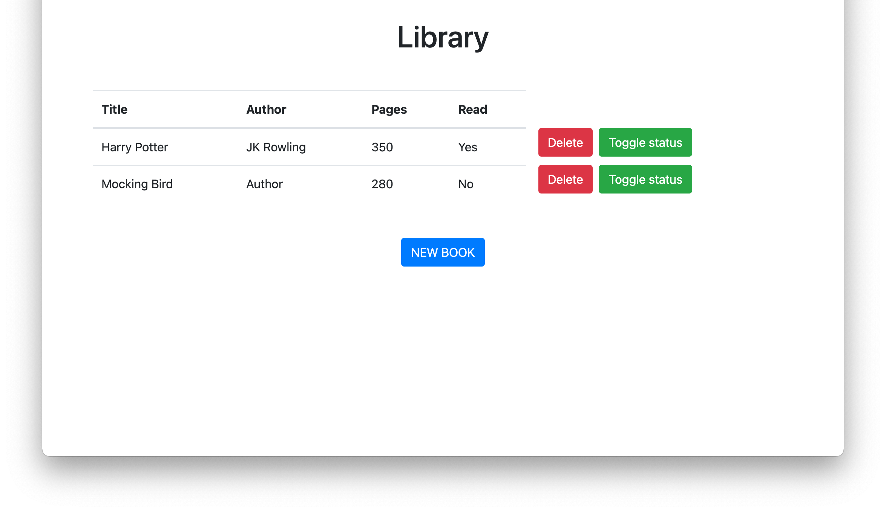

# Library


## Library Directory 📙
 
| Contents        |
| ------------- |
| [Built With](#built-with-🛠) |
| [Install](#install-⏳) |
| [Testing](#testing-⚙️) |
| [Authors](#authors) | 
| [License](#license) | 

## Description
> We have created a `Library` web-application that lets you create and delete books.



## Built With 🛠
```
- JavaScript
- HTML 5
- Bootstrap 4.5.3
- VS Code
```

## Live Demo

<button> <a href="https://meronokbay.github.io/library/"> Click here!</a> </button>


## Install ⏳

> Follow these steps below to get out Application working

1. - [ ] Open your `Terminal`
2. - [ ] Navigate to the directory where you will like to install the repo by running `cd FOLDER-NAME`
3. - [ ] Run `git clone git@github.com:meronokbay/library.git` to download <b>or</b> you can download using `HTTPS` by running `git clone https://github.com/meronokbay/library.git` in the terminal
4. - [ ] Open your browser
5. - [ ] Open `library/index.html`

## Testing ⚙️

1. - [ ] Run `npm i` to install
2. - [ ] Run `npx eslint .`
2. - [ ] Run `npx stylelint "**/*.{css,scss}"`

## Authors

### 👨‍💻 Daniel Ronan
[](https://github.com/DcRonan) <br>
[](https://www.linkedin.com/in/danronan10/) <br>
[](mailto:danielconnorronan@gmail.com) <br>
[](https://twitter.com/dc_ronan)

### 👨‍💻 Meron Ogbai
[](https://github.com/meronokbay) <br>
[](https://linkedin.com/in/meron-ogbai/) <br>
[](mailto:okbaymeron@gmail.com) <br>
[](https://twitter.com/MeronDev)


### 🤝 Contributing

Contributions, issues and feature requests are welcome!

Feel free to check the [issues page](https://github.com/meronokbay/library/issues).

### Show your support

Give a ⭐️ if you like this project!

### License


